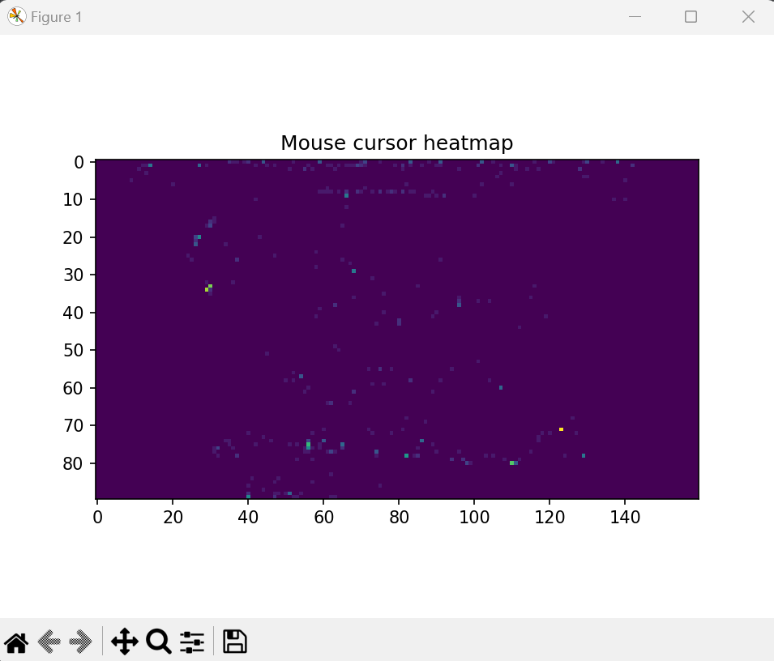

Mousetrap is a super-simple mouse cursor heat map generator.
It needs a working MySQL Server instance running to store its data.

Overall there are two commands - `collect` and `visualize`. Pretty self explanatory - the first collects mouse pointer data, the second visualizes it.
```
PS C:\Source\mousetrap> python.exe .\mousetrap.py        
Usage: mousetrap.py [OPTIONS] COMMAND [ARGS]...

Options:
  --help  Show this message and exit.

Commands:
  collect
  visualize
```

The `collect` command requires arguments to be specified to connect to the MySQL database to store data in, as well as a sampling period (in fractional seconds - how often to poll mouse position) and an inactivity period (in fractional seconds - how long a mouse stays in one place before it temporarily stop collecting data, until the mouse moves again).

```
PS C:\Source\mousetrap> python.exe .\mousetrap.py collect --help
Usage: mousetrap.py collect [OPTIONS]

Options:
  --mysql-db-host TEXT
  --mysql-db-port TEXT
  --mysql-db-user TEXT
  --mysql-db-password TEXT
  --mysql-db-name TEXT
  --mysql-db-table TEXT
  --sample-period FLOAT
  --inactivity-period FLOAT
  --help                     Show this message and exit.
```
```
PS C:\Source\mousetrap> python.exe .\mousetrap.py collect --mysql-db-host=localhost --mysql-db-port=3306 --mysql-db-user=admin --mysql-db-password=gigachad --mysql-db-name=mousetrap --mysql-db-table=events_fast --sample-period=0.1 --inactivity-period=1.0 

2023-06-26 23:24:35,855 WARNING db_open:69 :: successful open DB `None` <mysql.connector.connection.MySQLConnection object at 0x000001B588E9E4D0>
2023-06-26 23:24:35,856 WARNING db_create_database:77 :: found DBs [('information_schema',), ('mousetrap',), ('mysql',), ('performance_schema',), ('sakila',), ('sys',), ('world',)]
2023-06-26 23:24:35,856 WARNING db_create_database:83 :: database `mousetrap` already exists
2023-06-26 23:24:35,875 WARNING db_open:69 :: successful open DB `mousetrap` <mysql.connector.connection.MySQLConnection object at 0x000001B588E9E470>
2023-06-26 23:24:35,877 WARNING db_create_table:94 :: found tables [('events',), ('events_fast',)]
2023-06-26 23:24:35,878 WARNING db_create_table:109 :: table `events_fast` already exists
2023-06-26 23:24:35,990 WARNING db_record_mouse_position:42 :: INSERT INTO events_fast (time, x_position, y_position, x_size, y_size) VALUES (1687818275, 3111, 1879, 3840, 2160)
2023-06-26 23:24:36,099 WARNING db_record_mouse_position:42 :: INSERT INTO events_fast (time, x_position, y_position, x_size, y_size) VALUES (1687818276, 3111, 1879, 3840, 2160)
...
2023-06-26 23:25:09,649 WARNING db_record_mouse_position:42 :: INSERT INTO events_fast (time, x_position, y_position, x_size, y_size) VALUES (1687818309, 2659, 1936, 3840, 2160)
2023-06-26 23:25:09,760 WARNING collect:167 :: suspending data collection, mouse inactive for >= 1.0
2023-06-26 23:25:12,517 WARNING collect:172 :: resuming data collection, mouse wake up
2023-06-26 23:25:12,517 WARNING db_record_mouse_position:42 :: INSERT INTO events_fast (time, x_position, y_position, x_size, y_size) VALUES (1687818312, 2706, 1907, 3840, 2160)
2023-06-26 23:25:12,626 WARNING db_record_mouse_position:42 :: INSERT INTO events_fast (time, x_position, y_position, x_size, y_size) VALUES (1687818312, 2777, 1852, 3840, 2160)
...
2023-06-26 23:25:14,821 WARNING collect:167 :: suspending data collection, mouse inactive for >= 1.0
Aborted!
```

The `visualize` command displays a heatmap plot from data stored in a DB, specified by the arguments. It requires arguments to connect to a MySQL database - you'll want that to be the same one you used with the `collect` command, otherwise you should keep your expectations quite low. It also takes two integers - scale-width and scale-height, which represent how many "cells" the heatmap will be. Datapoints will be scaled to fit. You should pick something with the same aspect ratio as your screen. By default 640x480, I recommend something like 160x90 (yes 16:9) for 1080p or 4K displays.

```
PS C:\Source\mousetrap> python.exe .\mousetrap.py visualize --help
Usage: mousetrap.py visualize [OPTIONS]

Options:
  --mysql-db-host TEXT
  --mysql-db-port TEXT
  --mysql-db-user TEXT
  --mysql-db-password TEXT
  --mysql-db-name TEXT
  --mysql-db-table TEXT
  --scale-width INTEGER
  --scale-height INTEGER
  --help                    Show this message and exit.
```
```
PS C:\Source\mousetrap> python.exe .\mousetrap.py visualize --mysql-db-host=localhost --mysql-db-port=3306 --mysql-db-user=admin --mysql-db-password=gigachad --mysql-db-name=mousetrap --mysql-db-table=events_fast --scale-width=160 --scale-height=90
2023-06-26 23:25:30,875 WARNING db_open:69 :: successful open DB `mousetrap` <mysql.connector.connection.MySQLConnection object at 0x00000225625F24A0>
2023-06-26 23:25:30,876 WARNING db_select_all_mouse_position:53 :: SELECT time, x_position, y_position, x_size, y_size FROM events_fast
2023-06-26 23:25:30,880 WARNING visualize:215 :: fetched 482 entries
2023-06-26 23:25:30,881 WARNING visualize:239 :: processed 482 entries in 0.0 seconds
2023-06-26 23:25:30,882 WARNING visualize:248 :: populated frequency matrix shape (90, 160) entries in 0.0010013580322265625 seconds
2023-06-26 23:25:30,882 WARNING visualize:252 :: plotting values between 2023-06-26 22:18:36 - 2023-06-26 22:25:14
```

At this point you should see something like this pop up:
